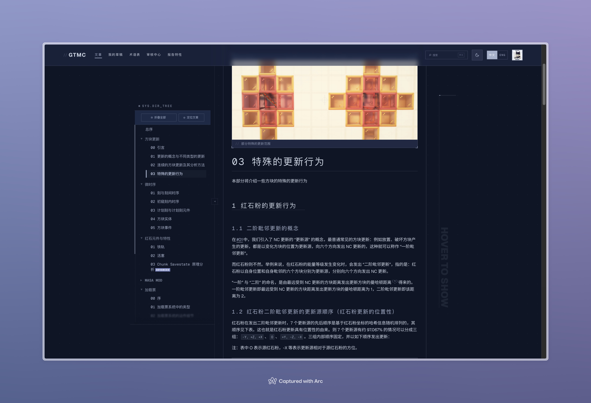

<!-- prettier-ignore -->
<div align="center">



# Graduate Texts in Minecraft

**社区共建的 Minecraft 技术在线教科书。**

从入门教程到机制讲解，再到源码解读。协作编写，公开评审。

[](https://beta.techmc.wiki) [](https://deepwiki.com/gtmc-dev/gtmc) [](https://nextjs.org) [](https://react.dev) [](https://www.typescriptlang.org) [](LICENSE) [](LICENSE)

[访问网站](https://beta.techmc.wiki) · [浏览原始文章](https://github.com/gtmc-dev/articles) · [更多 GTMC 项目](https://github.com/orgs/gtmc-dev/repositories)

<!-- README-I18N:START -->

[English](./README.md) | **汉语**

<!-- README-I18N:END -->

</div>

---

## 关于

Graduate Texts in Minecraft（*GTMC*）是一个开放、社区驱动的知识库，专注于 Minecraft 的技术层面——红石、游戏机制以及引擎内部原理。内容涵盖三种形式：

- `>> TUTORIALS` —— 面向建造者的分步教程。
- `>> EXPLANATIONS` —— 从基本原理出发的机制讲解。
- `>> CODE ANALYSIS` —— 带注释的游戏源码解读。

网站采用 **蓝图 / 科学制图** 视觉语言：细蓝灰分割线、方形几何、等宽字 HUD 标签、角括号装饰，动效更像是仪表读数而非装饰。详见 [`DESIGN.md`](DESIGN.md)。

> [!NOTE]
> 本仓库仅包含**网站**代码。文章内容存放在独立仓库中，以 Git 子模块形式引入。其他相关仓库见 [github.com/orgs/gtmc-dev](https://github.com/orgs/gtmc-dev/repositories)。

## 开发

### 技术栈

| 层级          | 选型                                                          |
| ------------- | ------------------------------------------------------------- |
| 框架          | Next.js 16（App Router、Cache Components）+ React 19          |
| 语言          | TypeScript 6                                                  |
| 样式          | Tailwind CSS v4，自定义 `tech-*` 蓝图主题变量                 |
| 动效          | `motion`（Framer Motion 的继任者）                            |
| 鉴权          | NextAuth v5（GitHub provider）+ Prisma adapter                |
| 数据          | Prisma 7，对接 Supabase Postgres                              |
| 内容          | Markdown + remark/rehype，KaTeX 数学，Shiki 代码，gray-matter |
| 编辑器        | CodeMirror 6（markdown、自动补全、合并视图）                  |
| 结构方块渲染  | `schematic-renderer` + Three.js                               |
| 搜索          | MiniSearch                                                    |
| i18n          | `next-intl`（`en`、`zh`）                                     |
| 部署          | Vercel（Speed Insights、Analytics、Blob）                     |
| Lint / 格式化 | oxlint、Prettier（含 Tailwind 插件）                          |
| 测试          | Vitest、Playwright、Lighthouse CI                             |

### 初始化

```bash
git clone https://github.com/gtmc-dev/gtmc.git
cd gtmc
pnpm install   # 如果 articles/ 子模块不存在，会自动初始化
cp .env.example .env   # 填写 GitHub OAuth、数据库 URL 等
pnpm dev
```

开发服务器运行在 <http://localhost:3000>。

### 脚本

```bash
pnpm dev              # 启动开发服务器
pnpm build:content    # 生成内容文件（manifest、glossary、文章、PDF）
pnpm build:next       # Next.js 生产构建
pnpm build            # 两阶段：先生成内容，再执行 Next 构建
pnpm build:pdf        # 仅重新生成离线 PDF
pnpm typecheck        # tsc --noEmit
pnpm lint             # oxlint
pnpm style            # prettier --check
pnpm lighthouse       # 本地运行 Lighthouse CI
```

**构建阶段：**

- `build:content` —— 生成静态内容文件（manifest、glossary、渲染后的文章、PDF）
- `build:next` —— 基于上述文件执行 Next.js 构建
- `build` —— 按顺序依次执行以上两阶段

### 目录结构

```text
.
├── app/                    Next.js App Router（按 locale 划分路由）
│   └── [locale]/
│       ├── (public)/       文章、公开页面
│       ├── (private)/      草稿、评审中心、个人主页、管理后台
│       ├── (auth)/         GitHub 登录流程
│       └── _homepage/      首页主卡片、前后景图层
├── components/ui/          TechCard、TechButton、CornerBrackets …
├── lib/                    文章处理、鉴权、数据库、搜索、GitHub 辅助
├── articles/               文章内容（Git 子模块，详见下文）
├── scripts/                Manifest、内容、PDF 生成脚本
├── messages/               i18n 文案（en.json、zh.json）
├── schema.prisma           数据库 Schema
└── DESIGN.md               视觉系统参考
```

### 子模块

`articles/` 是一个 Git 子模块，锁定在文章[仓库](https://github.com/orgs/gtmc-dev/repositories)的某个提交上。本地已有内容时，`pnpm install` 不会自动更新它。

```bash
pnpm articles:status                # 查看子模块状态
pnpm articles:init                  # 重新初始化到锁定的提交
pnpm articles:update                # 拉取最新的文章提交

pnpm generate:manifest              # 重新生成文章 manifest
pnpm generate:content               # 重新渲染内容
pnpm articles:pdf                   # 重新生成离线 PDF
```

> [!IMPORTANT]
> 要部署最新文章，需在本仓库中**提交更新后的子模块指针**。Vercel 构建时使用的是此处锁定的提交。

更多细节与贡献指引请参阅 [`CONTRIBUTING.md`](CONTRIBUTING.md)。

## 另见

所有文章（含草稿与待审稿件）见 [`gtmc-dev/articles`](https://github.com/gtmc-dev/articles)

---

<div align="center">

<sub>
代码：<a href="LICENSE">Apache-2.0</a> · 文章：<a href="https://creativecommons.org/licenses/by-nc-sa/4.0/">CC BY-NC-SA 4.0</a>
</sub>

</div>
